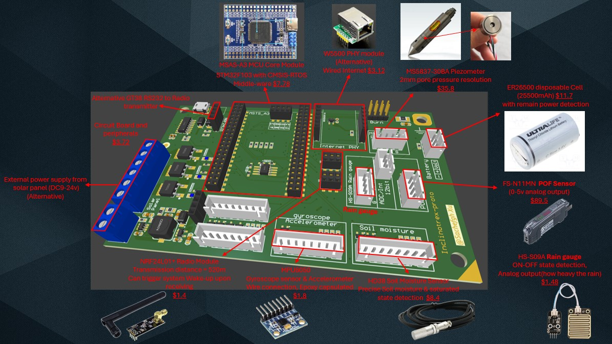

# Inclinotrex-proto
Design prototype for landslide monitoring. For study propose only.

# Warn
All analog input should be modified to [0 - 3v3]. Input >5v may damage the chip.

PCB design has not been verified.
